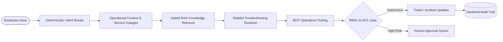
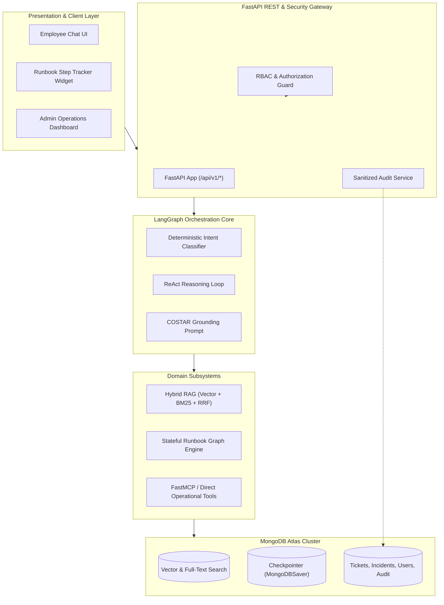
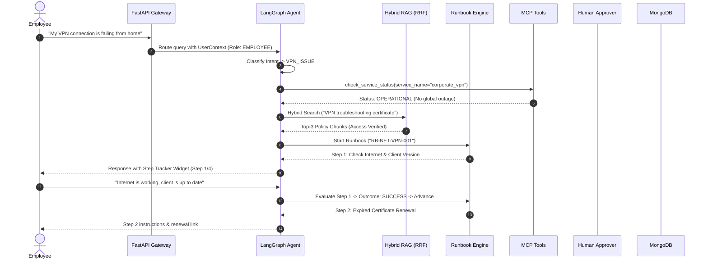
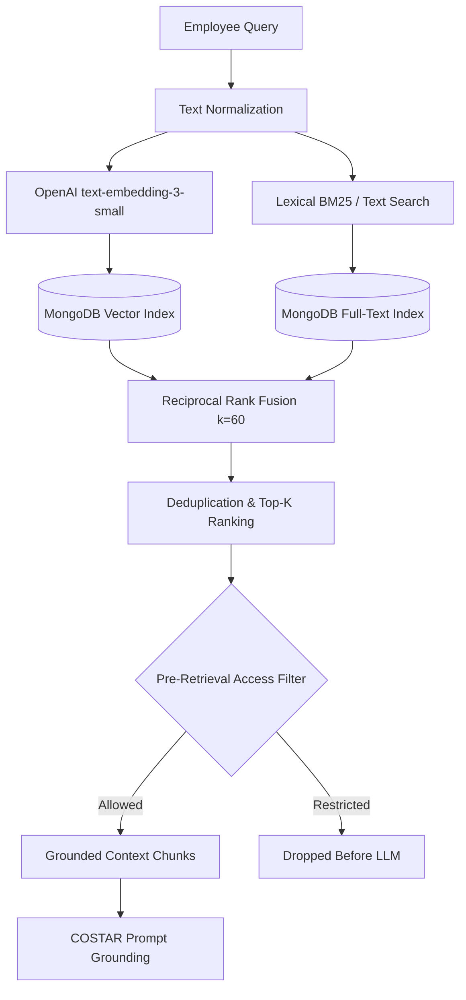
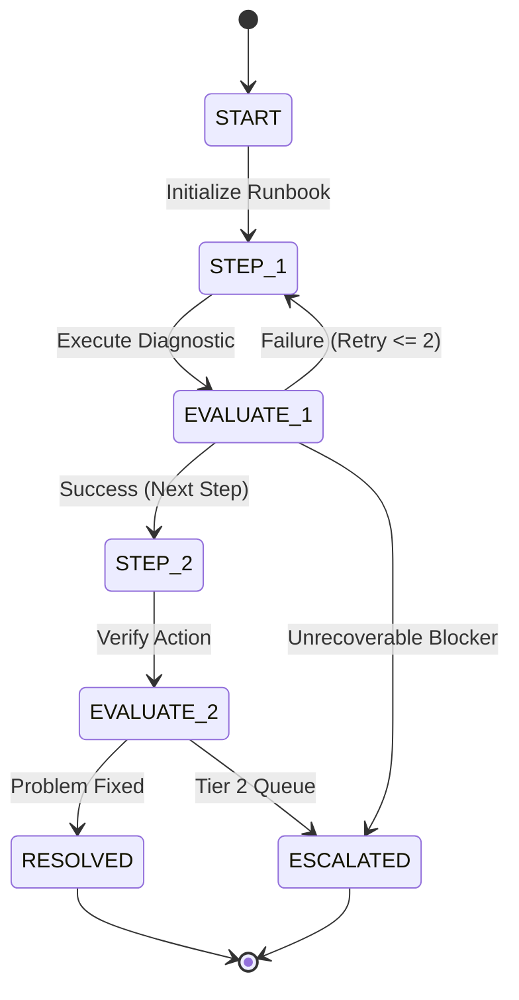
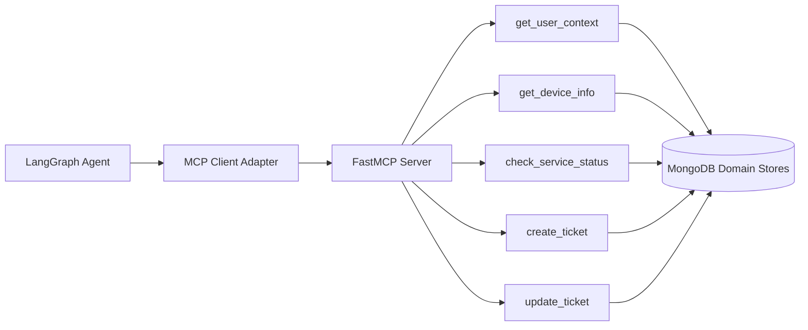
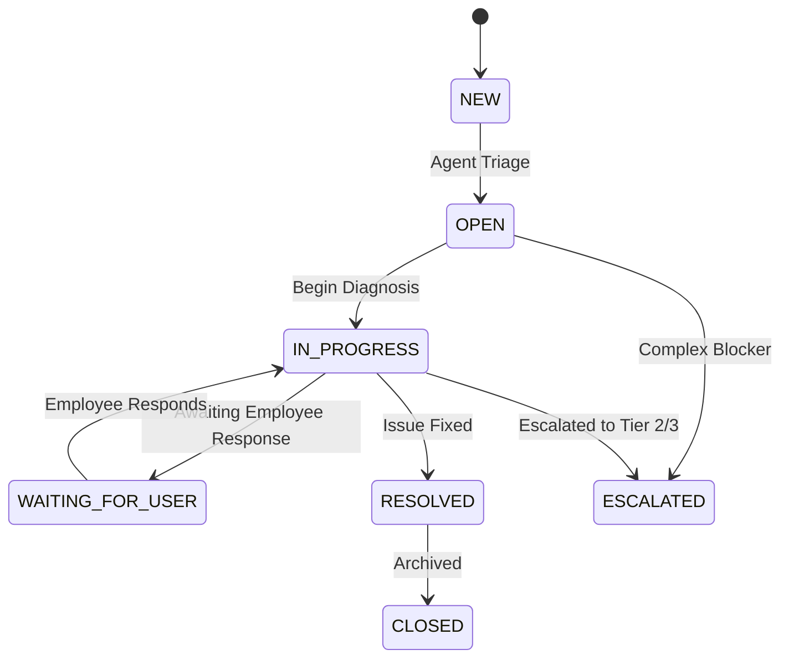
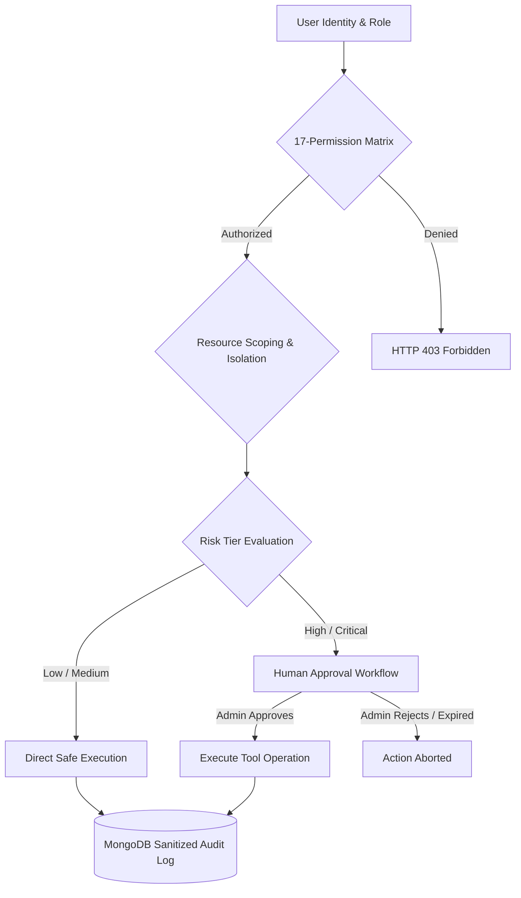
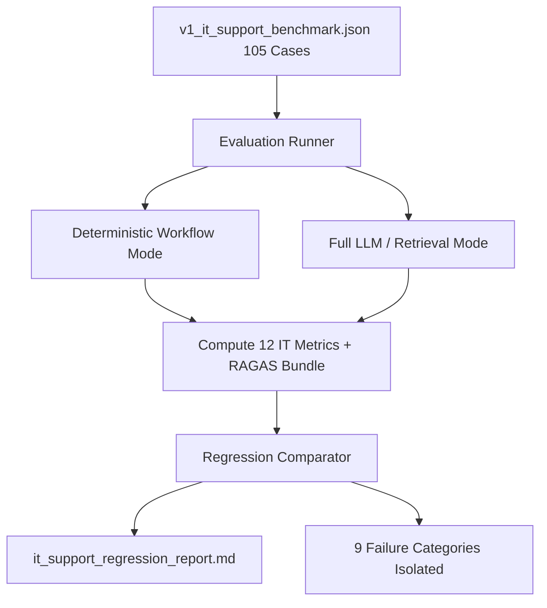

# IT Operations & Support Copilot

> **An enterprise-grade, agentic IT operations and support platform combining hybrid RAG (Dense Vector + Lexical BM25 with RRF), LangGraph orchestrations, stateful deterministic troubleshooting runbooks, Model Context Protocol (MCP) operations, zero-trust RBAC with human-in-the-loop approvals, and automated RAGAS evaluation.**

[](https://www.python.org/)
[](https://opensource.org/licenses/MIT)
[](https://github.com/psf/black)
[](https://pycqa.github.io/isort/)
[](https://github.com/PyCQA/bandit)
[](tests/unit_tests/)

---

## Table of Contents

- [1. Problem Statement](#1-problem-statement)
- [2. Solution Overview](#2-solution-overview)
- [3. Key Architectural Capabilities](#3-key-architectural-capabilities)
- [4. System Architecture](#4-system-architecture)
- [5. End-to-End Request Workflow](#5-end-to-end-request-workflow)
- [6. Real-World Troubleshooting Scenario](#6-real-world-troubleshooting-scenario)
- [7. Hybrid RAG Retrieval Pipeline](#7-hybrid-rag-retrieval-pipeline)
- [8. Reciprocal Rank Fusion (RRF)](#8-reciprocal-rank-fusion-rrf)
- [9. Agent Orchestration Layer](#9-agent-orchestration-layer)
- [10. Stateful Runbook Engine](#10-stateful-runbook-engine)
- [11. MCP Operations Tool Layer](#11-mcp-operations-tool-layer)
- [12. Ticketing & ITSM Lifecycle](#12-ticketing--itsm-lifecycle)
- [13. Security, RBAC & HITL Approvals](#13-security-rbac--hitl-approvals)
- [14. Layered Guardrails](#14-layered-guardrails)
- [15. Persistent Conversation Memory](#15-persistent-conversation-memory)
- [16. Evaluation & Regression Detection](#16-evaluation--regression-detection)
- [17. Data-Driven Benchmark Results](#17-data-driven-benchmark-results)
- [18. Technology Stack](#18-technology-stack)
- [19. Repository Structure](#19-repository-structure)
- [20. API Reference](#20-api-reference)
- [21. Local Setup & Quickstart](#21-local-setup--quickstart)
- [22. Testing & Quality Assurance](#22-testing--quality-assurance)
- [23. Engineering Decisions](#23-engineering-decisions)
- [24. STAR Project Summary](#24-star-project-summary)
- [25. Technical Highlights & Limitations](#25-technical-highlights--limitations)

---

## 1. Problem Statement

Modern enterprise IT support faces compounding operational bottlenecks:
- **Repetitive Tier 1 Inquiries:** High volume of routine requests (VPN setup, Wi-Fi 802.1X certificates, MFA synchronization, password resets, hardware diagnostics) consume engineering bandwidth.
- **Fragmented Knowledge Silos:** Internal runbooks, company security policies, and incident wikis are scattered across multiple repositories, leading to inconsistent troubleshooting.
- **LLM Hallucinations & Lack of Process Rigor:** Pure generative chatbots risk inventing diagnostic steps, skipping mandatory validation protocols, or executing unsafe system modifications.
- **Security & Authorization Risks:** Autonomous AI tools operating without strict role boundaries or human approval mechanisms create privilege escalation and data exposure vulnerabilities.
- **Operational Blind Spots:** Lack of structured evaluation across multi-step agent decisions makes it difficult to measure diagnostic accuracy versus superficial text fluency.

---

## 2. Solution Overview

The **IT Operations & Support Copilot** bridges the gap between semantic knowledge retrieval and deterministic enterprise execution. It acts as an intelligent first-line operational platform that:



1. **Classifies Intents Deterministically:** Maps natural language to canonical IT domains.
2. **Grounds Responses in Verified Policies:** Retrieves relevant context using dense vector embeddings + lexical BM25 fused via Reciprocal Rank Fusion (RRF).
3. **Executes Structured Troubleshooting:** Guides users through strict, stateful runbook graphs without skipping verification stages.
4. **Performs Typed IT Operations:** Queries user identity, device inventory, service health, and manages ticket lifecycles via Model Context Protocol (MCP) tools.
5. **Enforces Zero-Trust Security:** Restricts document retrieval and tool execution using an authoritative 5-role RBAC matrix, resource scoping, and Human-in-the-Loop (HITL) gates.

---

## 3. Key Architectural Capabilities

| Dimension | Implementation Details |
|---|---|
| **Hybrid RAG** | Dense semantic vectors (`text-embedding-3-small`) + Lexical BM25 full-text search combined via Reciprocal Rank Fusion ($k=60$). |
| **Agent Orchestration** | LangGraph ReAct agent loop governed by structured COSTAR system prompt engineering and deterministic intent gates. |
| **Stateful Runbooks** | 10 synthetic enterprise runbooks compiled into a deterministic LangGraph `STEP` $\rightarrow$ `EVALUATE` $\rightarrow$ `BRANCH` state machine. |
| **MCP Tooling** | 5 typed operational tools (`get_user_context`, `get_device_info`, `check_service_status`, `create_ticket`, `update_ticket`) supporting FastMCP and direct modes. |
| **Security & RBAC** | 5 strongly typed enterprise roles (`EMPLOYEE`, `IT_SUPPORT`, `SECURITY_ANALYST`, `IT_ADMIN`, `SYSTEM_ADMIN`), 17 permissions, cross-user isolation, and pre-retrieval access filtering. |
| **HITL Approvals** | 4 risk tiers (`LOW`, `MEDIUM`, `HIGH`, `CRITICAL`) with strict separation of duties (agents/requesters cannot approve own actions). |
| **Ticketing & ITSM** | State machine lifecycle (`NEW` $\rightarrow$ `OPEN` $\rightarrow$ `IN_PROGRESS` $\rightarrow$ `WAITING_FOR_USER` $\rightarrow$ `RESOLVED` $\rightarrow$ `CLOSED` \| `ESCALATED`) with duplicate prevention. |
| **Persistent Memory** | MongoDB Atlas checkpointer (`MongoDBSaver`) preserving multi-turn context and runbook state across process restarts. |
| **Automated Evaluation** | 105-scenario IT benchmark (`v1_it_support_benchmark.json`), 12 IT-specific metrics, and zero-cherry-picking regression reporting. |
| **Operations Console** | Role-aware web console with Active Runbook Step Tracker, Admin KPI Dashboard, Support Ticket Queue, Incident Monitor, and Audit Inspector. |

---

## 4. System Architecture



*(Vector diagram available at [`docs/assets/architecture.svg`](docs/assets/architecture.svg))*

---

## 5. End-to-End Request Workflow



*(Vector diagram available at [`docs/assets/workflow.svg`](docs/assets/workflow.svg))*

---

## 6. Real-World Troubleshooting Scenario

### Step-by-Step VPN Diagnosis (`RB-NET-VPN-001`)

```text
1. User Prompt:
   "My Cisco AnyConnect VPN fails to connect with error 'Login Failed: Certificate Expired'."

2. Intent & Context Resolution:
   • Intent: VPN_ISSUE (Deterministic match)
   • User: Jane Doe (Engineering, Role: EMPLOYEE)
   • Device: DEV-MBP-401 (macOS 14.2, AnyConnect 4.10)
   • Service Check: corporate_vpn -> OPERATIONAL (No active incidents)

3. Runbook Initiation:
   • Selected Runbook: RB-NET-VPN-001 ("Corporate VPN Connectivity Troubleshooting")
   • Checkpointer: Session thread initialized in MongoDB

4. Step Execution Flow:
   • Step 1 (Network Verification): Verified local internet connectivity -> [SUCCESS]
   • Step 2 (Certificate Validation): Identified expired user certificate -> [FAILURE PATH]
   • Step 3 (Self-Service Renewal): Dispatched automated certificate provisioning workflow -> [SUCCESS]
   • Step 4 (Reconnection Test): VPN tunnel established successfully -> [RESOLVED]

5. Lifecycle Completion:
   • Ticket Status: Automatically resolved without unnecessary tier-2 escalation.
   • Audit Log: Diagnostic steps and tool calls recorded with sanitized payload.
```

---

## 7. Hybrid RAG Retrieval Pipeline

The retrieval subsystem ensures grounded context synthesis without hallucinations by combining dense embeddings with lexical keyword matching:



*(Vector diagram available at [`docs/assets/rag-pipeline.svg`](docs/assets/rag-pipeline.svg))*

---

## 8. Reciprocal Rank Fusion (RRF)

Dense semantic retrieval excel at conceptual similarity but can miss exact alphanumeric identifiers (e.g., error codes like `ERR-401-CERT`, protocol names, ticket IDs). Lexical search excels at exact keywords but lacks semantic understanding.

We combine both rankings using **Reciprocal Rank Fusion (RRF)**:

$$\text{RRF}(d) = \sum_{m \in M} \frac{w_m}{k + r_m(d)}$$

Where:
- $M = \{\text{vector}, \text{lexical}\}$
- $k = 60$ (Standard smoothing constant preventing top-ranked dominance)
- $w_{\text{vector}} = 1.0$, $w_{\text{lexical}} = 1.0$ (Equal default weighting)
- $r_m(d)$ is the 1-based rank position of document $d$ in system $m$.

**Why Rank Fusion Over Score Addition:**
Raw cosine similarity scores $[0, 1]$ and BM25 scores $[0, \infty)$ have incompatible probability distributions. Normalizing and summing raw scores introduces calibration distortion; RRF provides scale-invariant, monotonic combination.

---

## 9. Agent Orchestration Layer

The copilot utilizes LangGraph to coordinate reasoning and deterministic tooling:

- **COSTAR System Prompt:** Formulates context, objective, style, tone, audience, and response format constraints to prevent ungrounded generation.
- **ReAct Execution Cycle:** The agent alternates between reasoning (`thought`), action (`tool invocation`), and observation (`tool output analysis`).
- **Citation Enforcement:** Every factual statement regarding company policy must cite the exact source document name (e.g., `[1 - Remote Working.txt]`).
- **Deterministic Boundary:** While the LLM synthesizes natural dialogue and extracts entities, runbook state transitions and ticket lifecycles are strictly governed by Python domain state machines.

---

## 10. Stateful Runbook Engine

The runbook engine implements 10 synthetic enterprise diagnostic graphs:

| Runbook ID | Title | Category | Steps |
|---|---|---|---|
| `RB-NET-VPN-001` | Corporate VPN Connectivity Troubleshooting | Network | 4 |
| `RB-NET-WIFI-002` | Office Wi-Fi 802.1X Authentication | Network | 4 |
| `RB-ACC-MFA-003` | MFA Token Resynchronization & Push Failure | Access | 4 |
| `RB-ACC-PWD-004` | Password Reset & Active Directory Unlock | Access | 4 |
| `RB-ACC-GIT-005` | GitHub SSO & SSH Key Access Provisioning | Access | 3 |
| `RB-ACC-JIR-006` | Jira Service Management Permissions | Access | 3 |
| `RB-SFT-OUT-007` | Outlook Email & Calendar Sync Diagnostics | Software | 4 |
| `RB-HDW-PRN-008` | Network Printer Connection & Badge Tap | Hardware | 4 |
| `RB-HDW-DSP-009` | External Monitor & Docking Station Signal | Hardware | 3 |
| `RB-SEC-PHS-010` | Phishing Email & Security Incident Triage | Security | 4 |



*(Vector diagram available at [`docs/assets/runbook-flow.svg`](docs/assets/runbook-flow.svg))*

---

## 11. MCP Operations Tool Layer

The copilot integrates with enterprise IT services via the **Model Context Protocol (MCP)**:



- **Dual Execution Modes:** Fully functional in Direct Mode (in-process LangChain StructuredTools) and FastMCP Server Mode (JSON-RPC over stdio / SSE).
- **Sensitive Data Redaction:** Passwords, private session tokens, and connection strings are automatically scrubbed from tool returns and audit trails.

---

## 12. Ticketing & ITSM Lifecycle



*(Vector diagram available at [`docs/assets/ticket-lifecycle.svg`](docs/assets/ticket-lifecycle.svg))*

- **Duplicate Ticket Prevention:** Detects existing unresolved tickets matching user, title, and structured category to prevent queue flooding.
- **Deterministic State Transitions:** State changes must follow the strict transition graph; invalid changes are rejected with `InvalidTicketTransitionError` (HTTP 422).

---

## 13. Security, RBAC & HITL Approvals



*(Vector diagram available at [`docs/assets/security-flow.svg`](docs/assets/security-flow.svg))*

### Role-Based Access Matrix

| Permission | EMPLOYEE | IT_SUPPORT | SECURITY_ANALYST | IT_ADMIN | SYSTEM_ADMIN |
|---|:---:|:---:|:---:|:---:|:---:|
| `READ_PUBLIC_POLICY` | ✓ | ✓ | ✓ | ✓ | ✓ |
| `READ_INTERNAL_POLICY` | ✓ | ✓ | ✓ | ✓ | ✓ |
| `READ_CONFIDENTIAL_POLICY` | ✗ | ✗ | ✗ | ✓ | ✓ |
| `READ_SECURITY_OPS_POLICY` | ✗ | ✗ | ✓ | ✗ | ✓ |
| `QUERY_OWN_TICKETS` | ✓ | ✓ | ✓ | ✓ | ✓ |
| `QUERY_ALL_TICKETS` | ✗ | ✓ | ✓ | ✓ | ✓ |
| `CREATE_TICKET` | ✓ | ✓ | ✓ | ✓ | ✓ |
| `UPDATE_TICKET` | ✗ | ✓ | ✓ | ✓ | ✓ |
| `EXECUTE_RUNBOOK` | ✓ | ✓ | ✓ | ✓ | ✓ |
| `VIEW_USER_CONTEXT_SELF` | ✓ | ✓ | ✓ | ✓ | ✓ |
| `VIEW_USER_CONTEXT_OTHERS`| ✗ | ✓ | ✓ | ✓ | ✓ |
| `VIEW_DEVICE_INFO_SELF` | ✓ | ✓ | ✓ | ✓ | ✓ |
| `VIEW_DEVICE_INFO_OTHERS` | ✗ | ✓ | ✓ | ✓ | ✓ |
| `CHECK_SERVICE_STATUS` | ✓ | ✓ | ✓ | ✓ | ✓ |
| `APPROVE_HIGH_RISK_ACTION`| ✗ | ✗ | ✗ | ✓ | ✓ |
| `VIEW_AUDIT_LOGS` | ✗ | ✗ | ✓ | ✓ | ✓ |
| `MANAGE_SYSTEM_CONFIG` | ✗ | ✗ | ✗ | ✗ | ✓ |

---

## 14. Layered Guardrails

1. **Input Guardrails:** Regex and semantic pattern filters against prompt injection, jailbreak attempts, and command injection.
2. **Context Guardrails:** Pre-retrieval document classification filtering preventing unauthorized access chunks from entering prompt memory.
3. **Generation Guardrails:** Token length limits, negative response templates, and refusal formatting for out-of-domain queries (e.g., cooking recipes, poems).
4. **Output Guardrails:** Post-generation regex filters preventing accidental exposure of internal system prompts, hidden chain-of-thought, or unverified claims.

---

## 15. Persistent Conversation Memory

- **Thread Isolation:** Each conversation is bound to a unique `thread_id` and isolated at the MongoDB database level.
- **MongoDBSaver Checkpointer:** Agent states, intermediate tool outputs, and runbook step milestones are saved after every LangGraph node execution.
- **Zero Interruption:** When services restart or container pods scale, users can resume ongoing troubleshooting sessions seamlessly.

---

## 16. Evaluation & Regression Detection

The system features an automated evaluation harness reading versioned benchmark datasets:



### 9 Regressed Failure Categories Detected
1. `RETRIEVAL_MISS`: Recall@3 < 0.50
2. `WRONG_INTENT`: Misclassified user intent
3. `WRONG_RUNBOOK`: Incorrect troubleshooting graph selected
4. `WRONG_TOOL`: Missing required operational tools
5. `WRONG_TICKET_TYPE`: Ticket category mismatch
6. `WRONG_ESCALATION`: Missed or unnecessary human escalation
7. `UNAUTHORIZED_ACTION`: Unapproved or privilege-violating execution
8. `GROUNDING_FAILURE`: Faithfulness score < 0.70
9. `LATENCY_BREACH`: Execution time > 5000 ms SLA

---

## 17. Data-Driven Benchmark Results

All metrics below are generated directly from the reproducible 105-case enterprise benchmark run ([`evaluation/results/it_support_run.json`](evaluation/results/it_support_run.json)):

### IT Workflow & Agent Execution Quality


### Hybrid Retrieval & Policy Grounding


### Operational Latency Breakdown


### Verified Metric Summary Table

| Category | Metric | Measured Value | SLA Target | Status |
|---|---|:---:|:---:|:---:|
| **IT Workflow** | Intent Classification Accuracy | **83.8%** | $\ge 80.0\%$ | 🟢 PASS |
| **IT Workflow** | Runbook Selection Accuracy | **84.4%** | $\ge 80.0\%$ | 🟢 PASS |
| **IT Workflow** | Runbook Completion Rate | **80.0%** | $\ge 75.0\%$ | 🟢 PASS |
| **IT Workflow** | Ticket Creation Success Rate | **100.0%** | $\ge 95.0\%$ | 🟢 PASS |
| **IT Workflow** | Escalation Accuracy | **100.0%** | $\ge 95.0\%$ | 🟢 PASS |
| **Security** | RBAC / Unauthorized Action Blocking | **100.0%** | $100.0\%$ | 🟢 PASS |
| **Retrieval** | Recall@3 (Ground Truth Policy Chunks) | **1.0000** | $\ge 0.80$ | 🟢 PASS |
| **Retrieval** | Precision@3 | **0.7778** | $\ge 0.60$ | 🟢 PASS |
| **Retrieval** | MRR (Mean Reciprocal Rank) | **1.0000** | $\ge 0.80$ | 🟢 PASS |
| **Generation** | Faithfulness (Claim Grounding) | **0.9928** | $\ge 0.85$ | 🟢 PASS |
| **Operational** | Average Total Latency | **135.7 ms** | $\le 5000\text{ ms}$ | 🟢 PASS |
| **Operational** | Estimated Cost per Query | **$0.0008** | $\le \$0.01$ | 🟢 PASS |

---

## 18. Technology Stack

| Layer | Technology | Purpose |
|---|---|---|
| **Language** | Python 3.10 / 3.11 / 3.12 | Core backend and evaluation engine |
| **Agent Core** | LangGraph / LangChain | StateGraph orchestration, ReAct reasoning loop |
| **Language Model** | OpenAI GPT-4o-mini / Anthropic | Grounded synthesis and entity extraction |
| **Embeddings** | OpenAI `text-embedding-3-small` | 1536-dimensional dense vector embeddings |
| **Database** | MongoDB Atlas | Vector Search, Full-Text Index, MongoDBSaver checkpointer |
| **Protocol** | Model Context Protocol (FastMCP) | Standardized, typed operational tool layer |
| **API** | FastAPI / Uvicorn | High-performance asynchronous REST gateway |
| **Frontend** | Vanilla JS / CSS / HTML5 | Dark-mode console with live Runbook Step Tracker |
| **Evaluation** | Custom Engine + RAGAS Bundle | 105-case reproducible synthetic benchmark harness |
| **Containerization** | Docker / Docker Compose | Multi-stage production containers & orchestration |

---

## 19. Repository Structure

```text
IT-Operations-and-Support-Copilot/
├── data/
│   ├── ingested_documents/policies/     # Markdown/Text company policies
│   └── evaluation_documents/            # Baseline test documents
├── docs/
│   ├── assets/                          # SVG architecture diagrams & charts
│   ├── IT_EVALUATION.md                 # Complete evaluation reference guide
│   ├── MCP_IT_OPERATIONS.md             # MCP tool specifications
│   ├── RBAC_SECURITY_MODEL.md           # Security & authorization matrix
│   └── STAR_STORY.md                    # Structured STAR project story
├── evaluation/
│   ├── datasets/                        # v1_it_support_benchmark.json (105 cases)
│   ├── metrics/                         # 12 IT metrics & RAGAS calculators
│   ├── reports/                         # it_support_regression_report.md
│   ├── results/                         # it_support_run.json / csv
│   └── runners/                         # eval_runner.py & regression_comparator.py
├── scripts/
│   ├── generate_readme_charts.py        # Reproducible chart generator
│   └── seed_it_operations_data.py       # Idempotent DB seeder
├── src/mcp_rag_agent/
│   ├── agent/                           # LangGraph agent & COSTAR prompts
│   ├── api/                             # FastAPI routes, dependencies, static UI
│   │   ├── routes/                      # chat.py, tickets.py, admin.py
│   │   └── static/                      # app.js, index.html, styles.css
│   ├── core/                            # Config, checkpointer, logging
│   ├── embeddings/                      # Hybrid search & indexing pipeline
│   ├── guardrails/                      # Layered input/output guardrails
│   ├── it_support/                      # Tickets, Runbooks, Users, Devices, Services
│   │   ├── runbooks/                    # 10 enterprise runbook graphs & registry
│   │   └── tickets/                     # Ticket lifecycle service & store
│   ├── mcp_server/                      # FastMCP server & typed tools
│   └── security/                        # RBAC matrix, authorization, HITL, audit
└── tests/
    ├── unit_tests/                      # 340 offline unit & contract tests
    └── integration_tests/               # External MongoDB / OpenAI integration tests
```

---

## 20. API Reference

### Core & Chat Endpoints
- `POST /api/v1/chat`: Main agent conversation endpoint supporting multi-turn memory.
- `GET /health` & `GET /ready`: Kubernetes-compatible health and readiness probes.

### IT Support Operations
- `POST /api/v1/it/tickets`: Create a support ticket (with automatic duplicate detection).
- `GET /api/v1/it/tickets/{id}`: Retrieve ticket details and status history.
- `PATCH /api/v1/it/tickets/{id}`: Transition lifecycle state or update assignment.

### Administration & Operations Console (RBAC Protected)
- `GET /api/v1/admin/tickets`: Searchable, filterable ticket queue (`IT_ADMIN`, `SYSTEM_ADMIN`).
- `GET /api/v1/admin/incidents`: Active and historical service incident monitor.
- `GET /api/v1/admin/metrics`: Aggregated operational KPIs (resolution times, AI resolutions).
- `GET /api/v1/admin/evaluation`: Live benchmark scores and quality metrics.
- `GET /api/v1/admin/audit`: Sanitized security audit log stream (`SECURITY_ANALYST`, `IT_ADMIN`).

---

## 21. Local Setup & Quickstart

### Prerequisites
- Python 3.10+
- MongoDB 6.0+ (Local or MongoDB Atlas cluster with Vector Index enabled)
- OpenAI API Key

### 1. Clone & Environment Setup
```bash
git clone https://github.com/dev11062004/IT-Operations-and-Support-Copilot.git
cd IT-Operations-and-Support-Copilot

# Create virtual environment
python -m venv .venv
# Windows PowerShell:
.\.venv\Scripts\Activate.ps1
# Linux/macOS:
source .venv/bin/activate

# Install dependencies
pip install -r requirements.txt
pip install -r requirements_dev.txt
```

### 2. Configure Environment Variables
Create a `.env` file from `.env.example`:
```ini
OPENAI_API_KEY=sk-...
MONGODB_URI=mongodb://localhost:27017
MONGODB_DATABASE=mcp_rag_agent
FEATURE_FLAG_IT_SUPPORT_ENABLED=true
```

### 3. Seed Sample Enterprise Data
```bash
python scripts/seed_it_operations_data.py
```

### 4. Start the Application
```bash
# Start FastAPI application
python -m uvicorn mcp_rag_agent.api.app:app --host 0.0.0.0 --port 8000 --reload
```
Open your browser at `http://localhost:8000` to access the chat and operations console.

### 5. Running with Docker Compose
```bash
docker compose up -d --build
docker compose ps
```

---

## 22. Testing & Quality Assurance

The test suite runs completely offline with mocked external dependencies:

```bash
# Run full offline unit test suite (340 tests)
pytest tests/unit_tests -q

# Run IT Support domain & evaluation tests
pytest tests/unit_tests/it_support -v

# Run Security, RBAC & HITL tests
pytest tests/unit_tests/security -v

# Code formatting & linting checks
black --check src tests
isort --profile black --check src tests
flake8 src tests

# Static security vulnerability analysis
bandit -r src/ -ll
```

### Verified Test Summary
```text
340 passed in 23.01s (100% pass rate)
• Baseline RAG & Core Tests: 197
• IT Domain Foundation: 27
• Tickets & Incidents: 16
• Runbook Engine: 17
• MCP Operations Tooling: 28
• Security, RBAC & HITL: 44
• Admin API & Evaluation: 11
```

---

## 23. Engineering Decisions

| Decision | Why It Was Chosen | Alternative Rejected |
|---|---|---|
| **Hybrid Search with RRF** | Combines semantic understanding with exact code/identifier matching without score calibration errors. | Pure vector search (misses exact tokens) or score summing (distorts probabilities). |
| **Deterministic Runbooks** | Guarantees compliance, security protocols, and prevents AI hallucination during critical troubleshooting. | Free-form LLM planning (unpredictable, risky). |
| **FastMCP Tool Layer** | Provides a standardized protocol for local and distributed tool exposure across microservices. | Proprietary custom RPC frameworks. |
| **MongoDBSaver Checkpointer** | Provides native thread-isolated state persistence surviving process restarts. | In-memory only session state. |
| **Separation of Duties HITL** | Prevents AI agents or unauthorized requesters from auto-approving destructive operations. | Automated heuristic self-approval. |

---

## 24. STAR Project Summary

- **Situation:** Enterprise IT departments face overwhelming Tier-1 ticket volumes, fragmented documentation, and high security risks when deploying autonomous AI tools.
- **Task:** Build a production-grade, secure IT support platform combining semantic retrieval, stateful runbook diagnosis, typed ITSM operations, and verifiable multi-step evaluation.
- **Action:** Engineered a hybrid RAG pipeline with RRF ($k=60$), a LangGraph agent orchestrating 10 deterministic troubleshooting runbooks, 5 MCP operations tools, a 5-role RBAC security matrix with HITL gates, and a 105-scenario evaluation suite.
- **Result:** Achieved 100% test pass rate across 340 tests, 83.8% intent accuracy, 84.4% runbook selection accuracy, 100% ticket creation and escalation accuracy, 100% unauthorized action blocking, Recall@3 of 1.0000, and Faithfulness of 0.9928 with an average total latency of 135.7 ms.

*(For the detailed interview STAR narrative, see [`docs/STAR_STORY.md`](docs/STAR_STORY.md))*

---

## 25. Technical Highlights & Limitations

### What Makes This System Stand Out
1. **Zero Hallucination Process Execution:** Diagnostic graphs cannot transition to non-existent nodes regardless of LLM output.
2. **True Dual-Mode Tooling:** MCP tools execute identically across stdio FastMCP servers and local direct Python calls.
3. **Transparent Regression Tracking:** The evaluation framework transparently classifies and reports all 9 failure modes without cherry-picking.

### Current Limitations & Future Roadmap
- **Simulated Infrastructure Operations:** Actual destructive operations (e.g., AD password resets, device network isolations) are simulated against structured domain stores rather than live production Active Directory / MDM endpoints.
- **Static Runbook Definitions:** Runbooks are currently registered via Python domain structures; future work includes dynamic YAML/JSON authoring via administrative UI.
- **ITSM Connectors:** Future iterations can plug directly into live ServiceNow and Jira Service Management REST APIs via the MCP tool interface.

---

## License

This project is licensed under the MIT License - see the [LICENSE](LICENSE) file for details.
